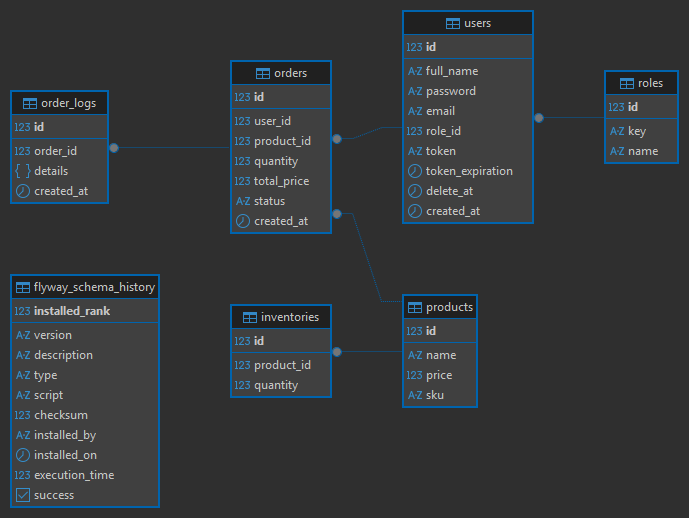

# Ecommerce Order Service

A sample project for managing ecommerce orders, designed with hexagonal architecture, SOLID principles, and Domain-Driven Design (DDD).

---

## Technology Stack

- **Java version:** 21
- **Spring Boot version:** 3.3.1
- **PostgreSQL version:** 15

---

## Project Description

This service provides order management for an ecommerce platform. It is built to be maintainable, scalable, and easy to understand, following modern software architecture and design principles.

### Key Features
- **Hexagonal Architecture (Ports & Adapters):** The core business logic is isolated from external systems (database, web, etc.), making the system flexible and easy to extend.
- **SOLID & DDD Principles:** The codebase is structured for clarity, separation of concerns, and domain focus.
- **Documented Architecture & Design Decisions:** See the architecture diagram below for a visual overview.

---

## Architecture Overview


The project structure follows a clear separation of concerns, inspired by hexagonal architecture:

- **domain/**: Contains the core business logic, domain models, and domain services. This layer is independent of frameworks and external technologies.
- **application/**: Implements use cases and coordinates domain logic. Application services live here, orchestrating business processes.
- **infrastructure/**: Contains adapters for external systems (database, cache, web controllers, etc.), repository implementations, and configuration files. This layer interacts with the outside world.
- **shared/**: Holds common utilities, constants, and cross-cutting concerns that can be reused across other layers.

**How it works:**
- The **domain** layer defines the business rules and entities.
- The **application** layer exposes use cases and orchestrates domain logic.
- The **infrastructure** layer provides implementations for ports (interfaces) defined in domain/application, such as repositories, event publishers, and REST controllers.
- The **shared** layer provides reusable components and helpers.

**Design Patterns Used:**
- Repository (data access)
- Service (business logic)
- DTOs & Mappers (data transfer between layers)

---

## Database ER Diagram

The following diagram shows the Entity-Relationship (ER) model for the main database tables used in the service:



---

## Testing

Only **unit tests** are provided, focusing on business logic and application services. There are no integration or end-to-end tests included.

---

## API Documentation & Postman Collection

- Import the Postman collection from [`src/main/resources/postman/`](src/main/resources/postman/) to test the API endpoints easily.
- API documentation is available at `/docs` and Swagger UI at `/swagger-ui.html` when the service is running.

---

## Environment Variables

Configure your environment variables in `application.properties`. Example (do not use these values in production):

```properties
spring.application.name=${APP_NAME:ecommerce-order-service}
server.port=${SERVER_PORT:8080}
spring.datasource.url=${DB_URL:jdbc:postgresql://localhost:5432/ecommerce}
spring.datasource.username=${DB_USERNAME:your_db_user}
spring.datasource.password=${DB_PASSWORD:your_db_password}

#OpenApi
springdoc.api-docs.path=/docs
springdoc.swagger-ui.path=/swagger-ui.html

server.error.include-message=always
server.error.include-binding-errors=always
server.servlet.context-path=/api/v1

#JPAHibernate
spring.jpa.hibernate.ddl-auto=update
spring.jpa.show-sql=false
spring.jpa.properties.hibernate.dialect=org.hibernate.dialect.PostgreSQLDialect
spring.jpa.properties.hibernate.format_sql=true
server.error.include-stacktrace=never
spring.data.jdbc.repositories.enabled=false
spring.jackson.serialization.FAIL_ON_EMPTY_BEANS=false
spring.datasource.hikari.data-source-properties.stringtype=unspecified
spring.datasource.hikari.data-source-properties.prepareThreshold=0
```

- `APP_NAME`: Application name
- `SERVER_PORT`: Server port
- `DB_URL`: PostgreSQL connection URL
- `DB_USERNAME`: Database username
- `DB_PASSWORD`: Database password

---

## Cache

Local caching is implemented using **Caffeine** for simplicity and performance. If you need distributed caching (e.g., Redis), you can adjust the configuration and dependencies accordingly.

Current configuration example:

```properties
spring.cache.type=caffeine
spring.cache.caffeine.spec=maximumSize=1000,expireAfterAccess=10m
```

---

## Getting Started

1. Clone the repository.
2. Set up your environment variables in `application.properties`.
3. Ensure PostgreSQL 15 is running and accessible.
4. Build and run the project using Maven or your preferred IDE.
5. Access API documentation and test endpoints using the provided Postman collection.

---

For any questions or improvements, feel free to contribute or open an issue.
